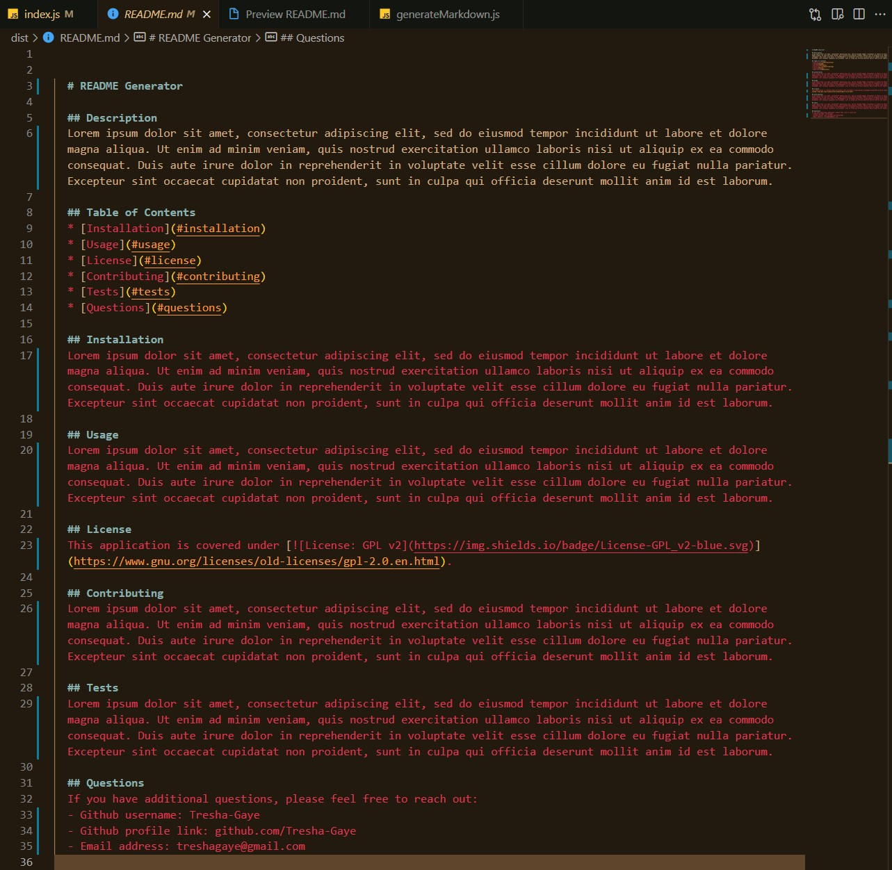

# Professional README Generator

## Description

This command-line application dyniamically generates a progfessional README.md file from a user's input using the `Inquirer package`. 

You may view the the walkthru video that demonstrates the application's functionality by [clicking this link](https://watch.screencastify.com/v/4JjdlM54sANvZl31IKIF).

**Technologies**  

The application was created by Node JS and the `Inquirer package`, JavaScript and Markdown.

**Criteria and Accomplishment**

- The application may be used by a developer (the user) to quickly create a professional README for a new project.
- It prompts the user to enter the project Title, and section such  as Description, Table of Contents, Installation, Usage, License, Contributing, Tests, and Questions.
- The app dynamically generates the badge for the license chosen from a list by the user, which is clickable to follow the link to the license itself.
- the user's contact information is also captured in the README based on the input of email address and Githib username and profile link. 
- Clicking on the links in the table of contents will navigate to the corresponding section of the README.

**Below are a screenshots of the app showing the functionality:**

This image shows how the terminal looks **when the app is run**, showing user-generated input  
 
  
 

This image shows the **generated README.md**  
 

This image shows the **preview of the README file**  
 
  

## Contributing

## Credits

**The following resources were used to complete this project:**
1. UCONN Coding Bootcamp's modules on Javascript and Node JS
2. README Guide [How to create a Professional README](./readme-guide.md)
3. [NodeJs](https://nodejs.org/api/modules.html) Documentation 
4. [Inquirer](https://www.npmjs.com/package/inquirer/v/8.2.0) Documentation 

## License

